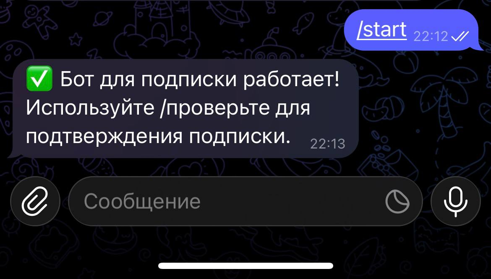
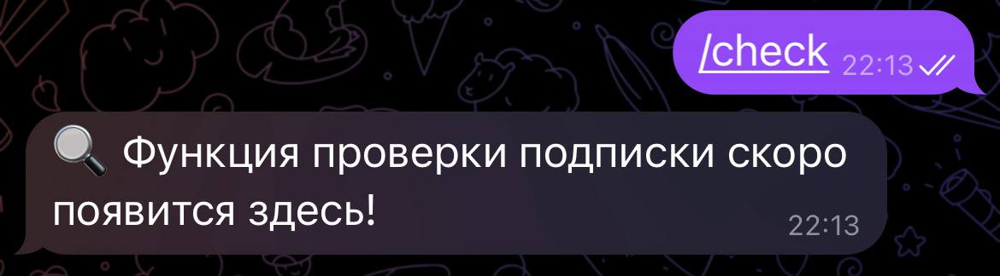

# 🤖 Telegram Subscription Bot

Бот для управления подписками и уведомлениями. Работает 24/7 на Render.

## ✨ Функционал
- **Система подписок** — ежедневные/еженедельные уведомления
- **Корзина** — оформление заказов
- **Уведомления** — мгновенные оповещения о заказах
- **Админ-панель** — управление через Telegram
- **24/7 хостинг**

## 🛠 Технологии
- **Python + aiogram 3.x**
- **Aiohttp сервер**
- **Render (хостинг)**
- **SQLite (база данных подписок)**

## 🚀 Быстрый старт
1. **Клонируйте репозиторий**  
   `git clone https://github.com/fnv4135-prog/subscription-bot-public.git`
2. **Установите зависимости**  
   `pip install -r requirements.txt`
3. **Настройте .env файл**  
BOT_TOKEN=ваш_токен
ADMIN_ID=ваш_id

4. **Запустите**  
`python aiohttp_server.py`

## 🌐 Деплой на Render
1. Создайте Web Service на [Render](https://render.com)
2. Подключите этот репозиторий
3. Добавьте переменные окружения (BOT_TOKEN, ADMIN_ID)
4. Start Command: `python aiohttp_server.py`
5. Бот работает 24/7

## 📸 Демо

## 📸 Скриншоты

## 💼 Заказать бота
**Telegram:** [@NicholasBiz](https://t.me/nicholas.biz)  
**GitHub:** [fnv4135-prog](https://github.com/fnv4135-prog)  
**YouTube:** [Демо бота](https://youtube.com/shorts/VVOiv7MlU9U?si=m3LOy3Um2Z5tZYjJ)

## 📄 License
MIT License. Подробнее в [LICENSE](LICENSE).